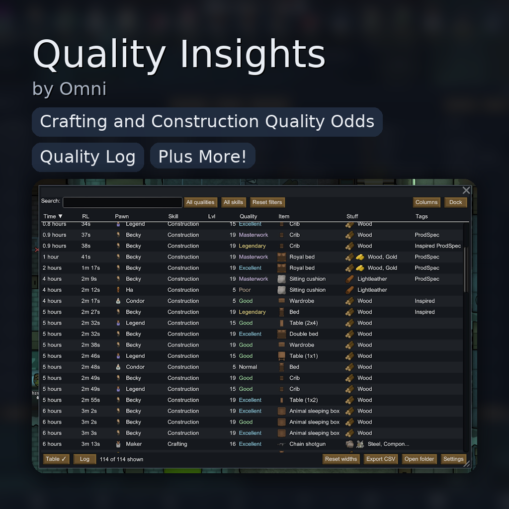

# Quality Insights

Quality log + live quality odds + optional dev cheat (≥ threshold) for RimWorld 1.6 *(and should also work in 1.4 and 1.5)*.

  

## Features

### Quality Log (Table & Log Views)

* Top-bar button opens a searchable, filterable log of all quality roll outcomes.
* **Pop out / Dock toggle**
  One button switches between a docked main-tab window and a floating window. Opening one closes the other, so only one is visible.
* **Floating window polish**
  Smaller top margin and a larger draggable area (grab along the top margin or header strip).
* **Resizable table UI**
  * **Sortable columns** (click header).
  * **Resizable columns** (drag splitters) with **persisted layout** in mod settings.
  * **Columns menu** (show/hide columns); includes **raw ID columns** (“Item ID”, “Stuff ID”) that are hidden by default.
  * **Reset column widths** from **either** the Mod Settings **or** the table footer.
  * **Zebra striping & hover highlights** for readability.
  * **Dynamic last column** auto-fills remaining width.
* **Responsive controls (no overlap)**
  * Header and footer controls **auto-size to fit labels** and **adapt** to smaller windows or larger fonts.
  * The search box shrinks first; lower-priority actions move into a **“⋯ More” overflow menu** when space is tight.
  * Applies **only** to the Quality Log (both docked and popped out); other windows are unchanged.
* **Search & filters**
  * **Inline clear (×)** button inside the search box.
  * **Ctrl/Cmd+F** focuses the search box.
  * **Quality** and **Skill** dropdown filters.
  * **Reset filters** button (next to filters) — clears **Search**, **Quality**, and **Skill** in one click and persists the cleared state.
  * **Materials-aware search** — search matches **Stuff** *and* per-ingredient **materials** for multi-mat items and **extra construction ingredients** (e.g., Components), using **raw defNames** *and* **friendly labels**.
  * **Persistent filters** — your **search text**, **Quality**, and **Skill** filters are **remembered** and restored when you reopen the log (docked or floating).
* **Row actions (right-click)**
  * **Copy row (friendly)**
  * **Copy row (raw)**
  * **Copy Item defName**
  * **Copy Stuff defName(s)**
  * **Delete row** — removes the entry from the log. **Hold Shift** when clicking to **skip the confirmation** dialog.
* **Row count status**
  Bottom-left indicator: **“X of Y shown”** (updates live with search/filters).
* **Time columns (2):**
  * **Time** — in-game “time ago” (e.g. `2d 4h`).
  * **RL** — **real-life play time elapsed** since the log entry (e.g. `1h 12m`).
    *Ignores time spent paused; updates live while unpaused.*
* Records: item, maker pawn, skill used, final quality, inspiration/role flags, and **materials**:
  * For crafting: distinct list with icons where available.
  * For construction: **includes additional ingredients** consumed by the build, not just Stuff.
* **Duplicate suppression** (only one entry per thing even if multiple `SetQuality` calls land).
* **CSV export** (+ **Open folder** button) with a **PlayTime** column matching the RL display.
  * CSV **Materials** column includes multi-mat recipes **and** extra construction ingredients.
* Export folder **auto-prunes** by count/size (configurable).

### Live Quality Odds – Work Tables **and Construction**

* **Work tables:** choose a recipe + pawn and see **full Awful → Legendary odds**.
* **Construction:** odds are available for **frames** *and* **blueprints** via a gizmo. Pick a constructor pawn and view construction quality odds.
* **Accurate skill resolver**
  * Uses recipe `workSkill` when present; otherwise infers: Construction (buildings), Artistic (CompArt/sculptures), Crafting (general).
* **Boost-aware odds**
  * **Inspired Creativity**: +2 tiers (caps at Legendary).
  * **Production Specialist** (Ideology): +1 tier.
  * Legendary is **capped post-shift** if not allowed; overflow mass goes to Masterwork.
* **Deterministic, cached sampling**
  * Sampling uses the real vanilla roll via Harmony; **cheat is always disabled during sampling** and inspiration side-effects are **suppressed** to keep the baseline clean.
  * Results are cached using a stable key (pawn, recipe/builtDef, boost mask, cheat flag) for snappy UI.
* **Dev-only validation**: “**Validate 100k**” button runs a large sample, compares vs. the UI, copies details to clipboard, and toasts a completion message.

### Construction Path Support

* Binds frame → completed building and attributes quality to the correct **builder pawn** (handles minified furniture).
* **Ingredient tracking for construction** — logs **all additional ingredients** actually consumed by the build (e.g., Components), not just Stuff; these show in the **Materials** column, are **searchable**, and are **included in exports**.

### Optional Dev Cheat (threshold-based, safe)

* Mod setting: “always roll at least the highest tier whose probability ≥ threshold.”
* **Never biases the odds UI** (cheat is force-disabled during sampling).
* **Respects Legendary rules** (still requires inspiration/role to reach Legendary).
* Implemented as a **safe single-hop bump** via `SetQuality`, with a reentrancy guard and art init safety (ensures `CompArt` is initialized when needed).

### Notifications (optional silencing)

* **Masterwork / Legendary** celebration spam got you down?
* Toggle **Silence Masterwork** and/or **Silence Legendary** in Mod Settings to suppress:
  * The **bottom-left toasts** (`Messages.Message`), and
  * The **right-side Letters** (blue mail icons) for the matching built/crafted item.
* Works across overloads, matches the specific product (handles **minified** inner things), and is robust to same-tick multiple calls.
  *(Dev Mode + QI debug logs will show what was suppressed and why.)*

### Diagnostics & Developer Quality-of-Life

* **Diagnostics** section in Mod Settings:
  * **Enable debug logs** (Dev Mode only) to emit detailed `[QI]` traces:
    * Flags (Inspired/ProdSpec, tier boost, mask).
    * Raw vs. final shifted distributions.
    * Context (pawn, skill, recipe/builtDef).
    * **Suppression traces** for Messages/Letters when notification silencing is enabled.
* Dev-only “**Validate 100k**” buttons in both odds windows (work tables & construction), with results copied to clipboard for easy sharing.

## How It Works (accuracy & safety)

* The odds UI samples the real `QualityUtility.GenerateQualityCreatedByPawn` via Harmony. During sampling we:
  * **Disable cheat**, **suppress inspiration side-effects**, and **strip inspiration** per roll to compute a true baseline.
  * Apply tier shifts once (+2 inspiration, +1 role) with a correct Legendary cap.
* Cheat uses a separate baseline estimation (also with cheat off / insp suppressed) and **only bumps one tier** safely if the target tier meets your threshold.
* **Real-life play time** is tracked by a lightweight component that accumulates seconds **only while the game is unpaused**. Each log entry stores a play-time snapshot; the UI shows *(currentAccum − snapshot)* — **no per-row timers**.

## Settings

* **Enable quality logging** (table/log feature).
* **Enable live chances widget** (gizmo on worktables, frames & blueprints).
* **Enable dev cheat** + **Min Cheat Chance** slider (0%–20%).
* **Estimation samples** slider (performance/precision trade-off).
* **Notifications**
  * **Silence Masterwork** and **Silence Legendary** (suppresses toast + right-side letter).
* **Diagnostics → Enable debug logs** (verbose `[QI]` logs; Dev Mode only).
* **Quality Log UI**
  * Font: Tiny / Small / Medium.
  * Row height scale.
  * **Reset column widths** (reverts to sensible defaults) — also available in the table footer.
  * **Open quality log** (quick access).
  * **Reset ALL settings** (one-click restore of every QI setting).
* **Retention**
  * Optional pruning by **age** (in-game days) and/or **entry count** (hard cap).
* **Exports**
  * Keep last **N** CSVs and/or cap the export folder by **MB**.

> **Localization**: strings live in `Languages/English/Keyed/QualityInsights.xml`.
> If you use versioned load folders (e.g. `1.5/` or `1.6/` in `About/LoadFolders.xml`), ensure the updated XML is copied to the **active** folder (`<modroot>/<version>/Languages/...`).

## Controls quick reference

* **Click** column headers to sort; **drag** splitters to resize.
* **Right-click** a row for copy tools **or to delete**. **Hold Shift** while clicking **Delete row** to skip the confirmation prompt.
* **Ctrl/Cmd+F** focuses the search box; click the **×** inside the box to clear.
* **Reset filters** clears **Search/Quality/Skill**.
* **Pop out / Dock** toggles the window mode.
* On cramped layouts, use **“⋯ More”** to access overflowed actions (e.g., **Columns**, **Reset filters**, **Pop out/Dock**; footer may overflow **Open folder**, **Reset widths**, **Export**, **Settings** as needed).

## Build

1. Open `Source/QualityInsights/QualityInsights.csproj` or run `dotnet build`.
2. Set `RimWorldManaged` to your `RimWorld*_Data/Managed` path (or edit the csproj property).
3. Build. The DLL is copied to `Assemblies/QualityInsights.dll`.

> **Note**: assets like `Languages/…` and textures are **not** compiled into the DLL; keep them in the mod folder you load in-game.

## Install

Copy the mod folder to `RimWorld/Mods/QualityInsights` (ensure `Assemblies/QualityInsights.dll` exists). Enable in the mod list.

## Use

* Click the **Quality Log** button to open the table (sort, resize, export). Use **Pop out/Dock** to switch window mode.
* Select a **work table**, click the **Quality odds** gizmo, pick a recipe + pawn to view tier odds.
* Select a **frame** (or **blueprint**) to use the **construction odds** gizmo; pick a constructor pawn to view tier odds.
* Right-click **rows** to copy data **or delete entries** (hold **Shift** to delete without confirmation).
* Configure options in **Mod Settings** (notifications, cheat threshold/samples, diagnostics, UI preferences, retention/exports).

## Compatibility & Notes

* Odds remain accurate with most quality-altering mods because we sample the actual roll.
* Legendary requires Inspired Creativity or the Production Specialist role; the cheat respects this.
* Construction quality is attributed to the builder pawn reliably, including minified furniture.
* **Ingredient tracking:** construction entries include extra ingredients; these flow into **search** and **CSV exports**.
* Performance: sampled odds are cached; the log’s RL time is cheap (single accumulator + per-row diff; **no per-row timers**). Column resizing persists and can be reset.

## Troubleshooting

* **Accented/garbled labels** → language keys weren’t found. Copy `Languages/English/Keyed/QualityInsights.xml` into the active version folder (per `About/LoadFolders.xml`) and use Dev Mode → *Reload language files*.
* **Columns won’t resize or revert unexpectedly** → click **Reset column widths** (footer or settings) to rebuild from defaults.
* **Still seeing Masterwork/Legendary notices** → check **Notifications** settings. With Dev Mode + QI debug logs enabled, look for `[QI] Marked for suppression…` and “Suppressed MESSAGE/LETTER…” traces around the time of the craft/build.

## Changelog (recent highlights)

* **New**: **Delete row** from the Quality Log (right-click). **Hold Shift** to delete **without** confirmation.
* **New**: **Construction ingredient tracking** — logs extra ingredients (e.g., Components) used by builds; searchable and included in exports.
* **New**: **Responsive header/footer** — buttons auto-size; search shrinks first; low-priority actions flow into a **“⋯ More”** overflow (no overlap on small windows/large fonts; Quality Log only).
* **New**: **Reset filters** button — one click clears Search/Quality/Skill and persists the cleared state.
* **New**: **Materials-aware search** — search matches Stuff *and* per-ingredient materials (multi-mat) by raw defName and friendly label.
* **New**: **Notification silencing** for **Masterwork/Legendary** — suppresses both the bottom-left toast *and* the right-side **Letter** (blue mail). Handles minified items and same-tick events.
* **New**: **Persistent filters** — search, Quality, and Skill are saved and restored when the log opens.
* **New**: **Construction quality odds** gizmo on **frames & blueprints** (choose a pawn, see full Awful→Legendary odds).
* **New**: **Columns menu** to show/hide columns; added hidden-by-default **Item ID** and **Stuff ID** columns.
* **New**: **Inline clear (×)** in the search box + **Ctrl/Cmd+F** to focus search.
* **New**: **Row context menu** (right-click) to copy friendly/raw rows and defNames.
* **New**: **Row count** status — “X of Y shown”.
* **New**: **Reset column widths** button in the table footer.
* **Improved**: Floating window drag area and top margin.
* **Improved**: Deterministic sampling, caching, and cheat isolation.
